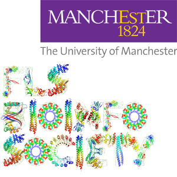

<p align="center">

</p>

Site underlying <strike>[uombioinfosoc.github.io/](https://uombioinfosoc.github.io/)</strike> [uombio.info](http://uombio.info), based on the [mediator Jekyll theme](https://github.com/dirkfabisch/mediator).

## Contributing

A guide to editing the site is underway in the [Wiki](https://github.com/UoMBioinfoSoc/UoMBioinfoSoc.github.io/wiki)

This blog allows for per-post author attribution, and we're happy to accept community contributions as pull requests (e.g. your slides or notes from a BioinfoSoc talk!). 

Add your details to [the authors.yml file](_data/authors.yml) in this format:

```yaml
author_id:                                 # pick an id, use this in your post YAML
  name: Your Name                          # name to display
  email: you@your.email                    # optional, will include mailto link
  twitter: https://twitter.com/yourtwitter # optional, will add link in footer
  image: an_image.jpg                      # optional small (e.g. 80x80) img in directory: assets/images/
  bio: A sentence or two on who you are!   # optional
```
